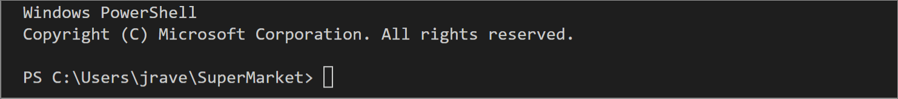

Welcome to the SuperMarket!
Current Most Workingest version of this is: bamazonMostRecent.js
# bamazon command line app
Step 1: start process in Terminal

Step 2: when that doesn't work, try again (no table)

Step 3: Why not start over and make a copy of the original folder? That's gotta be a thing!
If Not enough quantity, inform the user:

Step 4: Now, go back to the original folder and make a new file to fix all the horrible mistakes that have taken place. Erase any $dollar sign$ that are mucking up the code and preventing the table from appearing.

Step 5: Now you can see the table and enter in the id and quantity.

